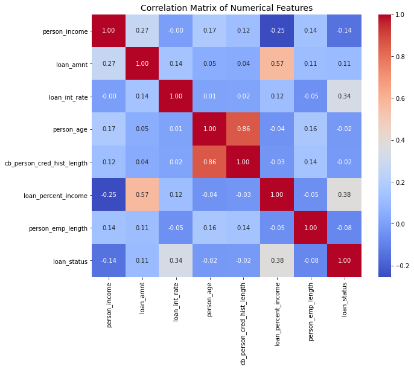

# Credit-Risk-Classification-with-Machine-Learning

## General objective
To develop a data-driven credit risk prediction model that classifies loan applicants as either low or high risk, using historical applicant information for financial institutions to use.

### Key stakeholders
-Commercial Banks,Saccos and Microfinance institutions 

-Loan officers and Underwriter 

-Risk and Compliance 

-Credit bureau Analysts 

## DATA UNDERSTANDING AND LOADING
The dataset in use was obtained from [kaggle](https://www.kaggle.com/datasets/laotse/credit-risk-dataset) and contains credit applicants' information sourced from a financial institution's loan book. Every record represents an individual who applied for a loan, alongside associated demographice, financial and credit history

The key feature decriptions:
- **Person_age**: The age of an individual applying for the loan.
- **Person_income**: Annual income of an individual.
- **Person_home_ownership**: The housing status of applicant i.e own, rent or mortgage.
- **Person_emp_length**: Employment period in years.
- **Loan_intent**: The purpose of the loan.
- **Loan_grade**: The assigned credit quality grade.
- **Loan_amnt**:Total amount of loan applied for.
- **Loan_int_rate**: The interest rate offered on the associated loan.
- **Loan_percent_income**: Loan amount as a percentage of income.
- **cb_person_defaul_on_file**: Historical default of the individual as per multiple records e.g credit bureau records (Example being Metropol in Kenya).
- **cb_person_cred_hist_length**: The length of credit history of the individual in years.
- **loan_status**: This is the target variable indicating loan risk i.e 0 being low risk and 1 being high risk

This historical record of loan applicants thats has behavioural, financial habits and creditworthiness includes both institutional risk metrics and personal attributes which will help in identification of patterns associated with loan default. Morever the insights are fundametal for building predictive models that will support responsible lending and ultimately reduce finacial risk.

## EXPLORATORY DATA ANALYSIS (EDA)
### Features vs Target Relationship

**a. person_income vs Loan Status**
- Both risk groups show wide income ranges and have medians being similar and substantial upper-end outliers
- Personal income may have have limited predictive power isolation. Perhaps more useful in combination with ratios like loan_percent_income

**b. loan_amnt vs Loan Status**
- Surprisingly, high-risk applicants tend to receive larger loan amounts with equally higher median.
- Larger loans tend to indicate riskier lending decisions and could ultimately signal default.

**c. loan_int_rate vs Loan Status**
- High-risk loans show significantly higher interest rates, with a clear separation in the medians.
- Interest rate is likely assigned based on borrower risk. Strong candidate for predictive modeling and risk profiling.

**d. person_age vs Loan Status**
- Age distributions are similar across both loan statuses, with overlapping medians and ranges.
- Age alone may not be a strong predictor. Consider segmenting into age groups or combining with credit history for better signal.

**e. cb_person_cred_hist_length vs Loan Status**
- Both groups have comparable credit history lengths. No dramatic spread or shift between classes.
- Credit history length may not drive default on its own, but could add value when paired with other behavioral features.

**f. loan_percent_income vs Loan Status**
- High-risk applicants have higher loan-to-income ratios, with a noticeably wider spread and higher median.
- Strong indicator of repayment pressure. Highly predictive feature — prioritize in modeling and risk scoring.

**g. person_emp_length vs Loan Status**
- With low-risk group, median emloyment length is higher whereas high-risk group is skewed toward shorter employment lengths-many falling below 5 year mark.Low risk distribution is tighter, showing more consistency and fewer extreme short-tenure cases whereas high-risk group are wide spread with more variability.
- Low-risk suggests applicants with longer, stable employment history are less likely to default whereas High-risk group indicates that borrowers with short unstable employment records may carry greater risk.

### Correlation Matrix

- **person_age** and **cb_person_cred_hist_length** show strong positive correlation (0.86) with older individuals generally having longer credit histories therefore variables may be conveying the same signal hence should be dropped or combine to reduce redundancy
- **loan_percentage_income** and **loan_int_rate** have a moderate positive correlation with **loan_status** hence this features deserve priority in feature selection and may rank highly in importance scores.
- **loan amount** and **person income** have weak correlation (<0.15) with loan status may not be directly predictive hence need for further exploration.

## MODELLING AND EVALUATION
For comparison purposes, we will the below models:
 1. **Random Forest**
 2. **Logistic regression**

 **Feature Importance plot**
 
 
 Our model predominantly trusts how the loan is structured and the income related metrics:
- **loan_grade_encoded** has the strongest signal, indicating that higher loan grades closely translate to creditworthiness
- **loan_percent_income** measures loan burden in relation to income hence a key stress indicator.
- **loan_int_rate** indicates how interest rate strongly mirrors lender risk espectations as higher rates implies riskier applicant.
- **person_income/log_income** after the reduction of skewness there is an enhanced signal.
- **loan_amnt** larger amounts often tends to correlate with higher repayment risk.

**Combined ROC CURVE**

SUMMARY COMPARISON OF THE TWO MODELS ON THE METRICS USED

| Metric               | Random Forest                         | Logistic Regression                      | Interpretation Summary                                                                 |
|----------------------|----------------------------------------|-------------------------------------------|-----------------------------------------------------------------------------------------|
| **Accuracy**         | 93%                                    | 74%                                        | RF shows high overall correctness; LR is moderately reliable                           |
| **Precision (0)**    | 93% (non-defaulters)                  | 91% (non-defaulters)                      | Both models predict safe borrowers well                                                 |
| **Precision (1)**    | 92% (defaulters)                      | 45% (defaulters)                          | RF is much better at accurately flagging risky borrowers                                |
| **Recall (0)**       | 98%                                    | 74%                                        | RF preserves almost all safe lending opportunities                                      |
| **Recall (1)**       | 72%                                    | 75%                                        | LR slightly outperforms RF in identifying defaulters                                    |
| **F1 Score (0)**     | 0.95                                   | 0.82                                       | RF maintains exceptional consistency for non-defaulters                                 |
| **F1 Score (1)**     | 0.81                                   | 0.56                                       | RF is more balanced for defaulters; LR recall-driven but with weaker precision          |
| **ROC-AUC Score**    | 0.94                                   | 0.82                                       | RF demonstrates stronger separation and confidence in predictions                       |

## INSIGHTS AND RECOMENDATIONS
- **Random Forest Model** clearly demonstrates superior performance across all metrics except Recall for defaulters. It's therefore well suited for deployment in automated risk scoring and credit segmentation environment/needs.
- **Logistic Regression Model** largely excells in recall for defaulters, making it appealing when the goal is to catch risky applicants though it may greatly sacrifice precision leading to a higher false positives.

Recommendations
- **Choose Random Forest** for deployment: With high precision, robust recall and feature transparency, the model is ideal for credit scoring engines which was our main objective.
- **Use Logistic Regression** for regulatory and or audit needs: As it offers fast and interpretable output which valuable in institutions when it comes to compliance and for policy formulation and reviews.